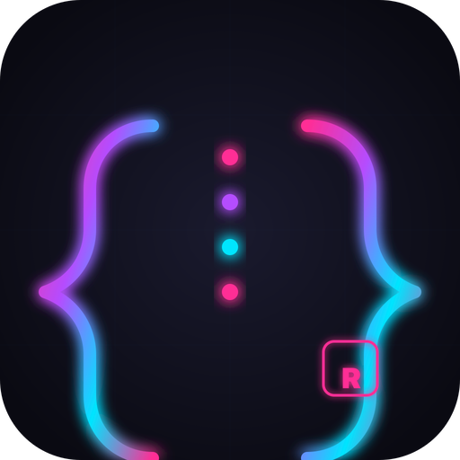
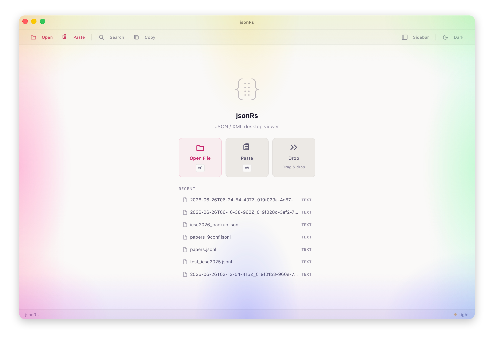
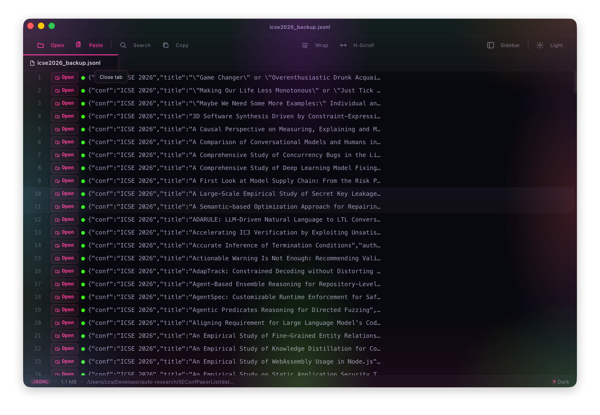
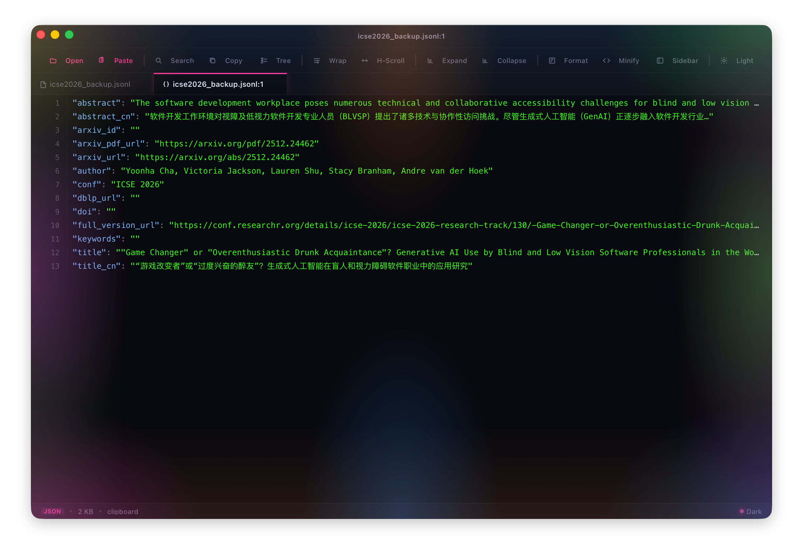
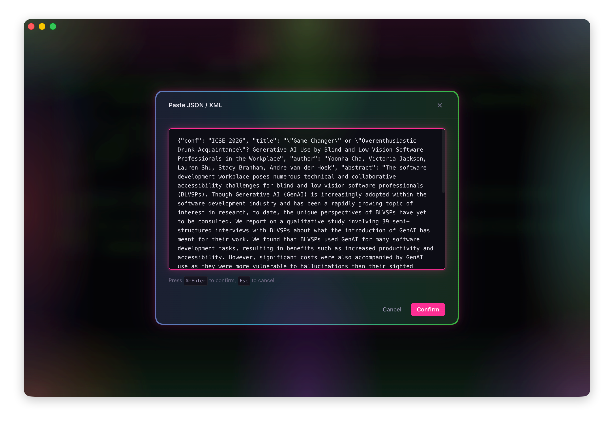
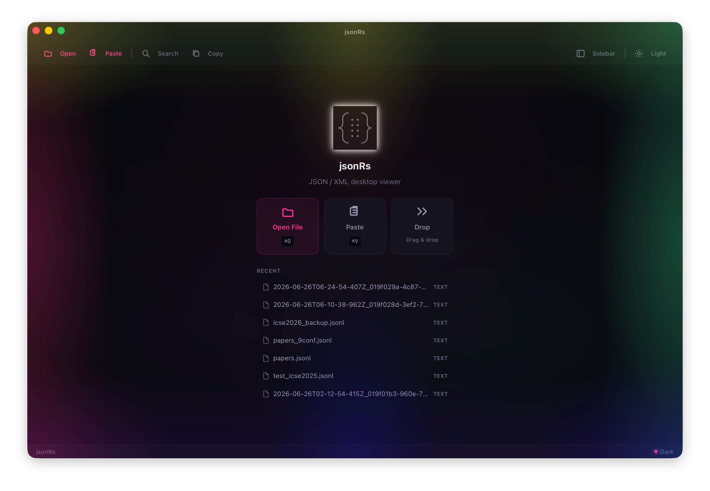

<p align="center">
  <a href="README.md">English</a> | <strong>中文</strong>
</p>

<p align="center">
  
  <h1 align="center">jsonRs</h1>
  <p align="center">
    轻量级、极速的 JSON / XML 桌面查看器，搭载 <strong>ROG 霓虹美学</strong> 设计。<br/>
    基于 Tauri 2 + React 19 构建。
  </p>
  <p align="center">
    
    
    
    
    
    
    
  </p>
</p>

## ✨ 特性

- **🌲 树形视图** — 可折叠、语法高亮的 JSON / XML 树，支持搜索高亮和缩进引导线
- **📝 文本视图** — 虚拟滚动纯文本查看器，带行号
- **🔀 分屏视图** — 树 + 文本并排显示，可拖拽霓虹分割条调整比例
- **🔍 全文搜索** — 正则、区分大小写、全词匹配，树/文本/分屏视图均支持内联高亮
- **📂 多标签页** — 同时打开多个文件，支持拖拽和剪贴板粘贴
- **⚡ 大文件支持** — 50 MB+ 文件浅层解析，按需展开子节点
- **🎨 ROG 霓虹主题** — 赛博朋克风格暗色模式：RGB 流光边框、霓虹发光效果、脉冲动画、扫描线、玻璃拟态。同时支持浅色模式。
- **⌨️ 快捷键** — ⌘O 打开、⌘F 搜索、⌘G 跳行、⌘W 关闭标签、⌘⇧T 切换主题
- **🔒 隐私优先** — 完全离线，无遥测，无网络请求

## 🎮 ROG 霓虹设计

暗色模式将 jsonRs 变身为赛博朋克风格查看器：

- **RGB 流光边框** — 对话框和面板上的动画渐变边框
- **霓虹发光效果** — 激活按钮、搜索聚焦、状态指示器的脉冲发光
- **缩进引导线** — 树视图中的微妙霓虹竖线连接父子节点
- **玻璃拟态** — 毛玻璃工具提示和对话框，带背景模糊
- **扫描线** — 暗色模式下微妙的 CRT 风格扫描线覆盖层
- **波纹效果** — 工具栏按钮点击时的 Material 风格扩散波纹
- **骨架屏加载** — 文件加载时的霓虹微光占位符
- **霓虹粉 / 青 / 紫 / 绿** — 鲜艳的赛博朋克色彩调色板

## 📸 截图

<p align="center">
  
  
  
  
  
</p>

## 🚀 快速开始

### 环境要求

| 工具 | 版本 | 安装方式 |
|------|------|----------|
| Node.js | ≥ 18 | [nodejs.org](https://nodejs.org) |
| pnpm | 最新 | `npm install -g pnpm` |
| Rust | ≥ 1.70 | [rustup.rs](https://rustup.rs) |
| Xcode CLT *(macOS)* | 最新 | `xcode-select --install` |

### 开发

```bash
# 克隆仓库
git clone https://github.com/zephyrq-z/jsonRs.git
cd jsonRs

# 安装依赖
pnpm install

# 启动开发服务器（自动打开应用）
pnpm tauri dev
```

### 构建

```bash
# 构建当前平台的应用
pnpm tauri build

# macOS：仅构建 DMG
pnpm tauri build --bundles dmg
```

编译后的应用位于 `src-tauri/target/release/bundle/` 目录下。

## 🏗️ 项目架构

```
jsonRs/
├── src/                        # React 前端
│   ├── App.tsx                 # 根组件（状态管理、快捷键、拖拽、搜索）
│   ├── main.tsx                # React 入口
│   ├── index.css               # ROG 霓虹主题 + Tailwind v4 + 自定义样式
│   ├── types/index.ts          # 共享 TypeScript 类型
│   ├── hooks/
│   │   ├── useFileTabs.ts      # 多标签页状态管理
│   │   ├── useTheme.ts         # 深色/浅色/系统主题
│   │   ├── useKeyboardShortcuts.ts  # 全局键盘快捷键
│   │   └── useClipboardPaste.ts     # 自动剪贴板粘贴
│   ├── context/
│   │   ├── TooltipContext.tsx   # 浮层提示系统
│   │   └── ToastContext.tsx     # Toast 通知系统
│   └── components/
│       ├── JsonTreeView.tsx     # JSON 树（可折叠、缩进引导线、搜索高亮）
│       ├── XmlTreeView.tsx      # XML 树（元素/属性/CDATA/注释、缩进引导线）
│       ├── TextViewer.tsx       # 虚拟滚动文本（行号、搜索）
│       ├── SplitPane.tsx        # 可拖拽分屏视图（霓虹拖拽条）
│       ├── Toolbar.tsx          # 顶部工具栏（霓虹发光、波纹效果）
│       ├── TabBar.tsx           # 标签页导航（霓虹强调色）
│       ├── SidePanel.tsx        # 侧边栏（文件信息、滚动阴影、搜索结果）
│       ├── SearchBar.tsx        # 搜索输入（霓虹聚焦发光、正则、导航）
│       ├── StatusBar.tsx        # 底部状态栏（呼吸灯指示器）
│       ├── PasteDialog.tsx      # 粘贴对话框（玻璃拟态 + RGB 边框）
│       ├── GoToLineDialog.tsx   # 跳转到行对话框
│       ├── ErrorBoundary.tsx    # React 错误边界
│       └── Placeholders.tsx     # 空状态 + 骨架屏加载
│
├── src-tauri/                  # Rust 后端
│   ├── Cargo.toml
│   ├── tauri.conf.json
│   ├── icons/                  # ROG 霓虹应用图标
│   ├── capabilities/default.json
│   └── src/
│       ├── main.rs             # 二进制入口
│       ├── lib.rs              # 模块注册 + Tauri Builder
│       ├── commands.rs         # 10 个 IPC 命令
│       ├── json_parser.rs      # JSON 解析（浅层 + 完整递归）
│       ├── xml_parser.rs       # XML 解析（quick-xml）
│       ├── file_reader.rs      # 文件读取 + 格式自动检测
│       ├── searcher.rs         # 正则搜索引擎
│       └── history.rs          # 最近文件历史（持久化）
│
├── package.json
├── vite.config.ts
└── tsconfig.json
```
### 关键设计决策

| 决策 | 原因 |
|------|------|
| **Tauri 2 而非 Electron** | ~5 MB 安装包 vs ~150 MB；原生性能 |
| **大文件浅层解析** | 文件 > 5 MB 时仅加载顶层键，子节点按需展开 |
| **Rust 端解析** | `serde_json` + `quick-xml` 比 JS 解析器快几个数量级 |
| **虚拟滚动** | `@tanstack/react-virtual` 仅渲染可见行，可处理 100 万+ 行文件 |
| **系统主题检测** | `prefers-color-scheme` 媒体查询 + 手动覆盖 |
| **ROG 霓虹暗色主题** | 赛博朋克风格设计，RGB 动画、霓虹发光、玻璃拟态 |

## ⌨️ 快捷键

| 快捷键 | 功能 |
|--------|------|
| `⌘O` / `Ctrl+O` | 打开文件对话框 |
| `⌘F` / `Ctrl+F` | 显示/隐藏搜索栏 |
| `⌘G` / `Ctrl+G` | 跳转到指定行 |
| `⌘W` / `Ctrl+W` | 关闭当前标签页 |
| `⌘⇧T` / `Ctrl+Shift+T` | 切换深色/浅色主题 |
| `Enter`（搜索中） | 下一个匹配 |
| `Shift+Enter`（搜索中） | 上一个匹配 |
| `Esc` | 关闭搜索 / 对话框 |

## 🛠️ 技术栈

**前端**
- [React 19](https://react.dev) — UI 框架
- [TypeScript 5](https://typescriptlang.org) — 类型安全
- [Vite 7](https://vite.dev) — 构建工具
- [Tailwind CSS v4](https://tailwindcss.com) — 实用优先的 CSS
- [@tanstack/react-virtual](https://tanstack.com/virtual) — 虚拟滚动

**后端**
- [Tauri 2](https://tauri.app) — 桌面框架
- [Rust](https://rust-lang.org) — 原生性能
- [serde_json](https://docs.rs/serde_json) — JSON 解析
- [quick-xml](https://docs.rs/quick-xml) — XML 解析
- [regex](https://docs.rs/regex) — 搜索引擎

## 🤝 贡献

欢迎贡献代码！请随时提交 Pull Request。

1. Fork 本仓库
2. 创建功能分支（`git checkout -b feature/amazing-feature`）
3. 提交更改（`git commit -m 'feat: add amazing feature'`）
4. 推送到分支（`git push origin feature/amazing-feature`）
5. 发起 Pull Request

## 📄 许可证

本项目基于 [MIT 许可证](LICENSE) 开源。